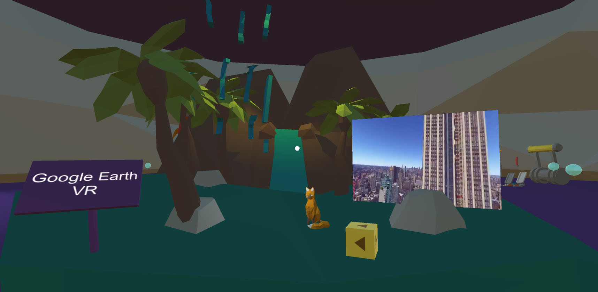

# nightAtTheMuseum
Night at the Museum is a mobile VR application for new VR users which showcases Education in the VR Industry in a fun and creative way through a series of five display points.

# Software Versions
GVR Unity SDK v1.70.0 
Unity 2017.2.0f3 

# Main Scene
The Main scene is located in Assets/Scenes/Main

# Writeup Link
http://gracemontoya.com/portfolio/vr-app-night-museum/

